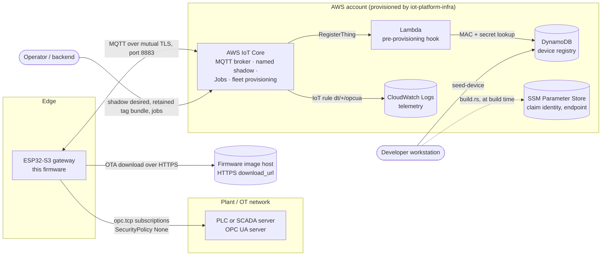
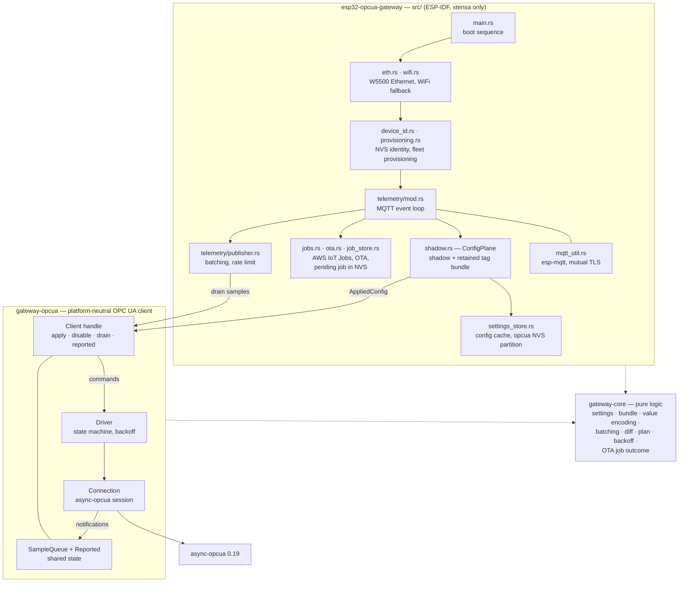
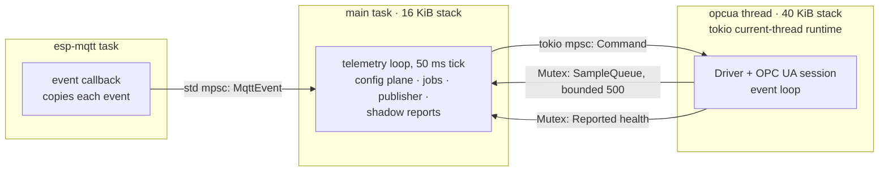
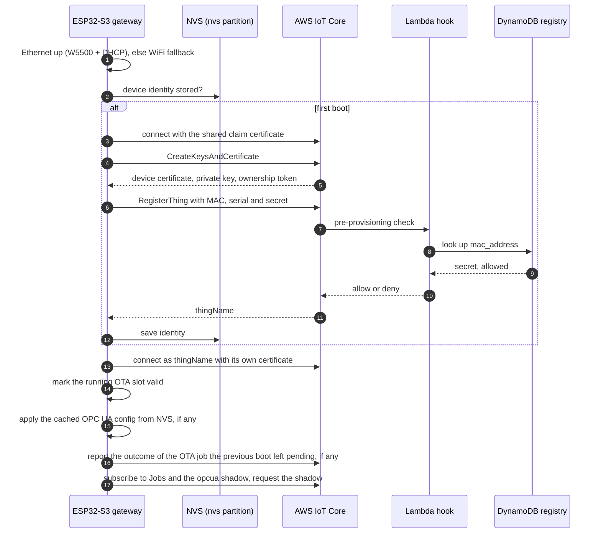
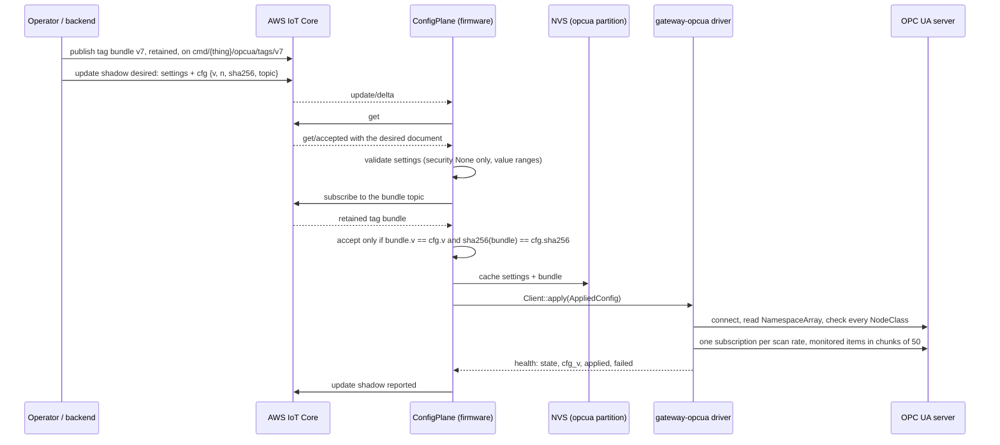
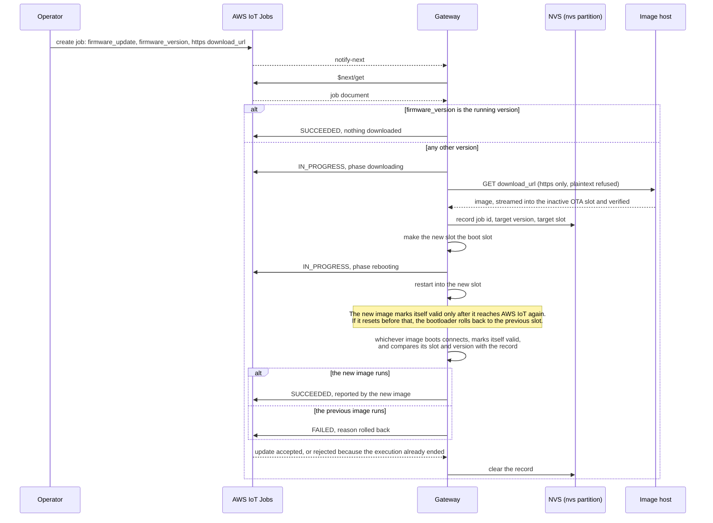
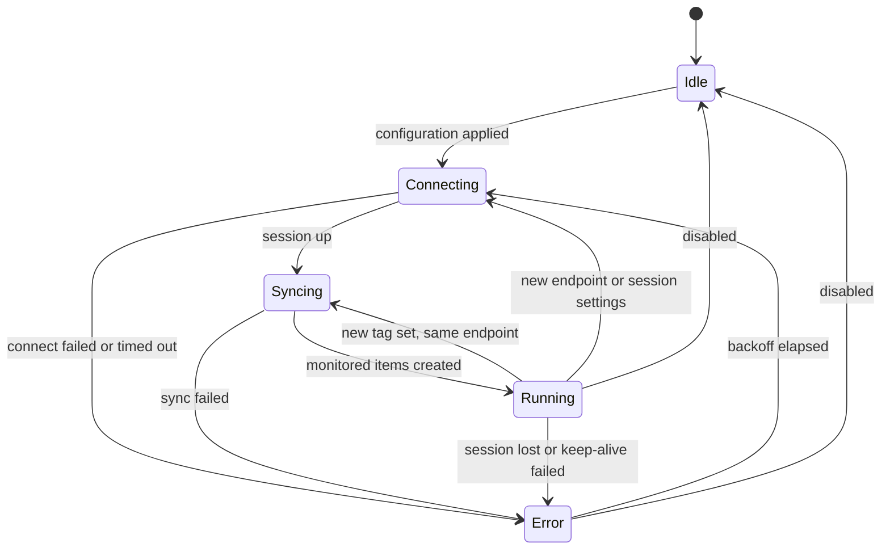
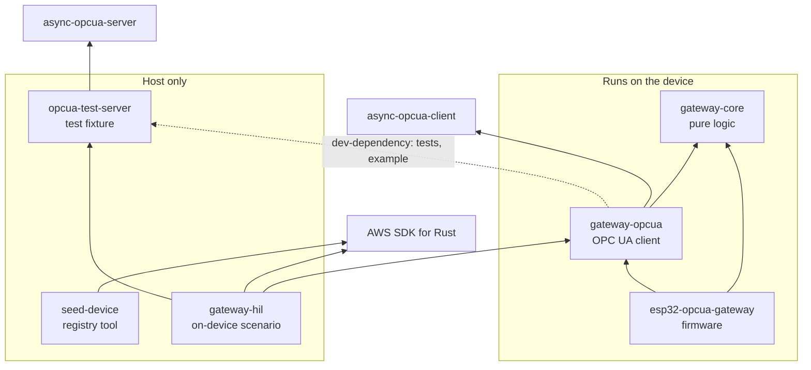
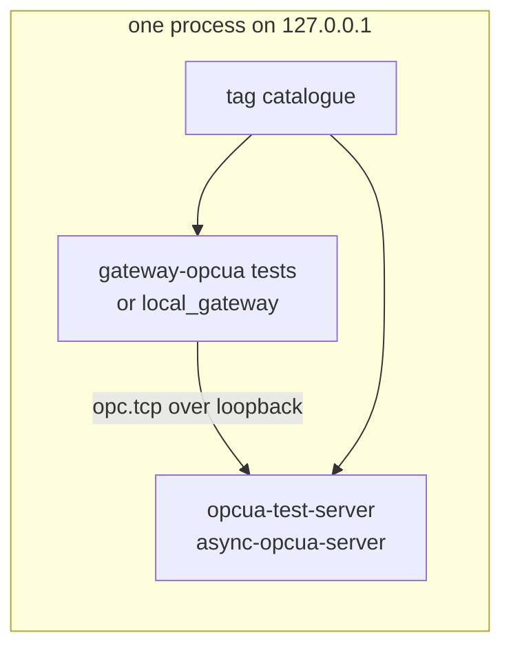

# ESP32-S3-ETH OPC UA Gateway (Rust)

An edge gateway that reads tags from a PLC over **OPC UA** and publishes them to
**AWS IoT Core**. It runs as `std` Rust on ESP-IDF on the
[Waveshare ESP32-S3-ETH](hardware/README.md), an ESP32-S3 (Xtensa LX7) with an
on-board W5500 wired Ethernet chip.

- **Zero-touch provisioning.** On first boot the device obtains its own X.509
  identity through AWS IoT *Fleet Provisioning by Claim*, keeps it in NVS, and
  from then on connects as itself.
- **Configured from the cloud, not at build time.** Which server to read, which
  tags, how often and how to batch them all arrive at runtime through a device
  shadow plus a retained tag bundle. The last good configuration is cached on
  flash, so the gateway keeps collecting when the WAN is down.
- **OPC UA subscriptions, batched telemetry.** Values are reported by exception,
  encoded losslessly, and published in size- and rate-limited batches.
- **Remote firmware updates** through AWS IoT Jobs, into dual OTA slots with
  automatic rollback.
- **Testable without hardware.** Everything except device I/O builds for the
  development host, including the OPC UA client, which is tested end to end
  against a real OPC UA server over loopback.

Networking tries wired Ethernet (W5500 + DHCP) first and falls back to WiFi
(`cfg.toml`) when there is no link or lease.

**Contents:**
[Architecture](#architecture) ·
[Repository layout](#repository-layout) ·
[Running and testing without hardware](#running-and-testing-the-opc-ua-client-without-hardware) ·
[Getting started](#getting-started) ·
[Hardware](#hardware) ·
[Documentation](#documentation)

---

## Architecture

### System context



| External system | What the gateway exchanges with it |
| --- | --- |
| **OPC UA server** (PLC / SCADA) | The gateway is the OPC UA *client*: it opens one session, one subscription per scan rate, and reads the `NamespaceArray` to resolve namespace URIs. Phase 1 is SecurityPolicy `None` + anonymous only, on a trusted OT network. |
| **AWS IoT Core** | One mutually authenticated MQTT connection carries every plane: provisioning, the `opcua` named shadow, the retained tag bundle, Jobs, and telemetry. |
| **DynamoDB registry + Lambda** | Fleet provisioning succeeds only for a MAC and secret registered here (`cargo run -p seed-device`). |
| **CloudWatch Logs** | Where the `dt/+/opcua` IoT rule lands telemetry; also what the on-device test reads. |
| **SSM Parameter Store** | Read by `build.rs` at build time for the claim certificate, the IoT endpoint and the provisioning template name. Never contacted by the device. |
| **Image host** | The HTTPS `download_url` of an OTA job, typically a presigned S3 URL. |

The AWS resources — IoT policy, provisioning template, Lambda hook, registry
table, IoT rule and SSM parameters — live in the separate
`iot-platform-infra` repository.

### Components



The firmware crate is the only part tied to the device. It is a thin
effectful shell: networking, identity, MQTT, NVS, OTA, and the glue between
them. The decisions — what a valid configuration is, how a value is encoded,
when a batch is flushed, how long to back off — live in `gateway-core` as pure
functions. The OPC UA client lives in `gateway-opcua`, which the firmware
plugs in through a single handle:

```rust
let (client, driver) = gateway_opcua::new(options);          // clock, backoff seed
gateway_opcua::spawn_thread(driver, "opcua", 40 * 1024)?;    // own thread + runtime
client.apply(config)?;           // from the config plane
let samples = client.drain(128); // from the telemetry loop
let health = client.reported();  // mirrored into the shadow
```

### Runtime and concurrency



The OPC UA stack is isolated on its own thread and runtime. It talks to the MQTT
loop only through a bounded, coalescing sample queue and a command channel, so
an unreachable or misbehaving PLC can never stall the path that delivers a
firmware update. The driver never panics; every failure becomes
`reported.last_error` and a backoff.

### Boot and provisioning



### Configuration plane

A 250-tag list does not fit in AWS IoT's 8 KB shadow limit, so configuration
travels on two planes. The named shadow `opcua` carries the small settings and
a **pointer** to the tag list; the list itself is a compact, grouped **tag
bundle** published *retained*, so a rebooting device receives it on subscribe.



The version-and-digest gate lives in one place, `gateway_opcua::AppliedConfig::new`,
whichever way a configuration arrives: MQTT, the NVS cache, or a file on a
laptop. The two planes therefore cannot desynchronise silently, and
re-delivering an applied version is a no-op. A security policy other than
`None` is **refused**, never downgraded. Schema and limits:
[`docs/OPCUA_CLIENT_REQUIREMENTS.md`](docs/OPCUA_CLIENT_REQUIREMENTS.md) §4.

### Telemetry data flow

```mermaid
flowchart LR
    plc["OPC UA server"] -->|"DataChange notifications"| sink["subscription sink<br/>Variant to TagValue,<br/>stamped with cfg version"]
    sink --> queue["SampleQueue<br/>bounded 500,<br/>coalesces per address"]
    queue -->|"drain up to 128<br/>every 50 ms"| batcher["Batcher<br/>flush on count, bytes,<br/>age or config version"]
    batcher --> publisher["Publisher<br/>at least 20 ms apart,<br/>at most 2 batches pending"]
    publisher -->|"MQTT QoS 1<br/>dt/{thing}/opcua"| iot["AWS IoT Core"]
    iot -->|"IoT rule dt/+/opcua"| cw["CloudWatch Logs"]
```



A batch is a positional array of rows, `[address, source_ts_ms, value]`, plus a
4th element carrying the StatusCode only when it is not Good:

```json
{"t":1753660800000,"v":7,
 "d":[["Line1.Temp",1753660799871,23.5],
      ["Line1.BigCounter",1753660799902,{"$t":"i64","v":"9007199254740993"}],
      ["Line1.Faulty",1753660799910,null,2156396544]]}
```

- Values are self-describing and lossless: integers beyond 2⁵³, byte strings
  and GUIDs are tagged (`{"$t":"i64"|"u64"|"b64"|"guid","v":"…"}`) rather than
  squeezed through a double, and `f32` is widened by its shortest decimal
  form.
- `v` is the configuration version the rows were **collected** under; a batch
  never mixes two.
- The queue and the batch limits bound memory; the publish spacing keeps the
  connection far inside AWS IoT's per-connection publish rate, leaving room
  for shadow, Jobs and OTA traffic.

### Firmware updates (OTA)



The image that downloads an update never reports it SUCCEEDED: until the new
image has reached AWS IoT and marked itself valid, the bootloader can still
roll it back. The outcome is reported by whichever image runs after the
reboot, from the record kept in NVS. Until the Jobs service has acknowledged
it, the device takes no other job, and the execution the service offers again
at boot (still IN_PROGRESS) is settled, never downloaded a second time. A fresh
image that fails before it can mark itself valid restarts rather than stopping,
so the bootloader does roll it back. The full flow, its edge cases, and a
hardware check for a good and a bad update:
[`docs/FIRMWARE_INTEGRATION.md`](docs/FIRMWARE_INTEGRATION.md) §4.

### OPC UA driver lifecycle



The state is mirrored into the shadow's `reported.state`. The driver's jittered
exponential backoff (1 s doubling to 60 s) is the only retry mechanism —
async-opcua's own reconnect loop is switched off, so a dead or silent server is
reported as `error` within seconds instead of looking `running`, and a fleet
does not reconnect in lockstep after a server restart. A live reconfiguration
on the same endpoint rebuilds the subscriptions without reconnecting; a disable
completes within 3 s even if the server never answers.

### MQTT interface

| Topic | Direction | Plane | Purpose |
| --- | --- | --- | --- |
| `$aws/certificates/create/json` (`/accepted`, `/rejected`) | both | provisioning | CreateKeysAndCertificate, first boot only, as `claim-<MAC>` |
| `$aws/provisioning-templates/{template}/provision/json` (`/accepted`, `/rejected`) | both | provisioning | RegisterThing |
| `$aws/things/{thing}/shadow/name/opcua/get` (`/accepted`, `/rejected`) | both | config | read `state.desired` |
| `$aws/things/{thing}/shadow/name/opcua/update` (`/delta`, `/rejected`) | both | config | change notifications in, `state.reported` out |
| `cmd/{thing}/opcua/tags/v{N}` | cloud → device, retained | config | the tag bundle for config version N |
| `$aws/things/{thing}/jobs/notify-next`, `…/jobs/$next/get` (`/accepted`), `…/jobs/{jobId}/update` (`/accepted`, `/rejected`) | both | control | OTA jobs and their status |
| `dt/{thing}/opcua` (set in the shadow's `telemetry.topic`) | device → cloud | data | telemetry batches |

The device policy must grant the named-shadow topics as well as the others: an
unauthorised SUBSCRIBE makes AWS IoT drop the **whole** connection, Jobs and OTA
included ([`docs/OPCUA_INTEGRATION_TEST.md`](docs/OPCUA_INTEGRATION_TEST.md) §8.1).

### Key architectural decisions

| Aspect | Decision | Why |
| --- | --- | --- |
| Isolation | OPC UA on its own thread and tokio runtime; bounded queue + command channel to the MQTT loop | A PLC problem must never block MQTT, Jobs or OTA. |
| Configuration transport | Shadow pointer + retained tag bundle | 250 tags do not fit the 8 KB shadow. |
| Configuration integrity | Applied only when version **and** SHA-256 match | The two planes cannot desynchronise; torn or stale bundles are refused. |
| Offline operation | Last good configuration cached in the dedicated `opcua` NVS partition, applied at boot | Keep collecting when the WAN is down; a large bundle can never evict the device identity. |
| OPC UA security | SecurityPolicy `None`, anonymous; anything else refused; a warning logged on every connect | No filesystem, no key store (decisions D2/D3). The OT network is treated as trusted. |
| Retry | One jittered backoff, in the driver | Failures stay visible; no fleet-wide reconnect storms. |
| Tag validity | NodeClass checked before subscribing | "Failed tag" means the same thing on every server, strict or lenient. |
| Telemetry format | Positional rows, self-describing lossless values, status only when not Good | Small payloads without silent data loss. |
| Backpressure | Coalescing queue, count/size/age batching, spaced publishes | Bounded heap; well inside AWS IoT publish limits. |
| Memory budget | 250-tag cap, 16 KiB OPC UA messages, type table preloaded at boot, mbedTLS dynamic buffers | ~300 KB of heap and no PSRAM. |
| Identity | Per-device X.509 from fleet provisioning by claim, gated by a MAC + secret registry | Zero-touch, and only registered devices can enrol. (The PoC secret is shared and built into the firmware; per-device secrets are a production item, see [`src/config.rs`](src/config.rs).) |
| Updates | HTTPS-only OTA into dual 7 MiB slots, rollback until the new image reaches AWS; the job outcome reported after the reboot, by the image that actually runs | A bad image cannot brick a unit in the field, and a rollback cannot pass for a success. |
| Testability | Everything but device I/O builds for the host; OPC UA tested against a server from the same library | Fast feedback, and no dependence on a LAN or host firewall. |
| Flash layout | Frozen, with spare partitions reserved up front | The partition table is not rewritten by OTA. |

The full rationale for the OPC UA side is in
[`docs/OPCUA_CLIENT_REQUIREMENTS.md`](docs/OPCUA_CLIENT_REQUIREMENTS.md) §9.

### Flash layout

16 MiB flash, defined in [`partitions.csv`](partitions.csv). The table is **not**
rewritten by an OTA update, so it is frozen for every unit that has left the
bench.

| Partition | Offset | Size | Holds |
| --- | --- | --- | --- |
| `nvs` | `0x9000` | 24 KiB | device identity (AWS IoT certificate + key), the pending OTA job |
| `phy_init` | `0xf000` | 4 KiB | RF calibration |
| `otadata` | `0x10000` | 8 KiB | which OTA slot boots |
| `nvs_key` | `0x12000` | 4 KiB | reserved: NVS encryption keys |
| `opcua` | `0x13000` | 52 KiB | cached OPC UA settings + tag bundle |
| `ota_0` / `ota_1` | `0x20000` / `0x720000` | 7 MiB each | application slots (image ≈ 5.3 MB) |
| `storage` | `0xe20000` | 1664 KiB | reserved: future filesystem / telemetry spool, not mounted |
| `coredump` | `0xfc0000` | 256 KiB | reserved: panic core dumps |

---

## Repository layout

A Cargo workspace. Only the firmware crate at the root is tied to the device;
everything else builds and runs on the development host.

```
.
├── src/                     # the firmware (ESP-IDF, xtensa only)
│   ├── main.rs              # boot: eth up -> provision-or-load -> telemetry
│   ├── eth.rs, wifi.rs      # W5500 via esp_eth (DHCP); WiFi fallback (cfg.toml)
│   ├── device_id.rs         # embedded claim certs + NVS device identity + MAC
│   ├── provisioning.rs      # Fleet Provisioning by Claim client
│   ├── telemetry/           # normal operation: MQTT loop + batched publisher
│   ├── shadow.rs            # config plane: `opcua` named shadow + tag bundle
│   ├── settings_store.rs    # NVS cache of the last applied OPC UA config
│   ├── jobs.rs, ota.rs      # AWS IoT Jobs / OTA
│   ├── job_store.rs         # NVS record of the OTA job the next boot must report
│   └── mqtt_util.rs         # mutual-TLS MQTT client wrapper
├── gateway-core/            # pure logic: settings, bundle, encoding, batching, backoff
├── gateway-opcua/           # the OPC UA client: session, subscriptions, reconnect
│                            # state machine — platform-neutral, plugged into src/
├── opcua-test-server/       # OPC UA test server on async-opcua-server (the server
│                            # half of the client's own library) + tag catalogue
├── gateway-hil/             # on-device scenario runner (ESP32 + AWS + test server)
├── seed-device/             # registers a device (MAC + secret) in the DynamoDB registry
├── crates/                  # vendored [patch.crates-io] sources (ESP-IDF fixes)
├── build.rs                 # fetches the claim identity and endpoint from SSM
├── partitions.csv           # the frozen flash layout
├── cfg.toml.example         # WiFi creds / IoT endpoint -> copy to cfg.toml (gitignored)
├── certs/                   # claim cert + root CA (build-embedded; see certs/README.md)
└── docs/                    # firmware notes, OPC UA requirements, test architecture
```

How the crates depend on each other:



## Running and testing the OPC UA client without hardware

The OPC UA client is written against no device API, so it runs on a laptop
exactly as it runs on the ESP32. Host builds only need `--target host-tuple`,
which overrides the xtensa default in `.cargo/config.toml`:

```sh
# unit tests of the pure logic
cargo test -p gateway-core --target host-tuple

# the real client against a real OPC UA server, both in one process on
# 127.0.0.1: provisioning, every value encoding, live reconfiguration, server
# loss and recovery, a silent link, disable — ~20 s, no device, no firewall
cargo test -p gateway-opcua --target host-tuple

# run the client interactively; telemetry is printed as it would be published
cargo run -p gateway-opcua --example local_gateway --target host-tuple

# …or point it at a real PLC on the LAN (the laptop dials out)
cargo run -p gateway-opcua --example local_gateway --target host-tuple -- \
    --endpoint opc.tcp://192.168.1.50:4840 --ns 3 --tag Channel1.Device1.Tag1

# the OPC UA test server on its own, for a device to dial
cargo run -p opcua-test-server --target host-tuple -- --bind 0.0.0.0 --host <lan-ip>
```



The server is `async-opcua-server`, the server half of the library the client
uses, so both ends speak the same stack, and one tag catalogue drives both the
server's nodes and the configuration the client is given. The on-device
scenario (`cargo run -p gateway-hil`) covers what only hardware can show: heap,
the ESP-IDF runtime, NVS and the AWS planes. On a host the device cannot reach,
such as a firewalled workstation, `--offline` runs the part that needs no route
back to the host. See
[`docs/OPCUA_INTEGRATION_TEST.md`](docs/OPCUA_INTEGRATION_TEST.md) §7.

---

## Getting started

### Toolchain

The ESP32-S3 (Xtensa LX7) needs Espressif's Rust fork instead of upstream
`rustc`, plus the native ESP-IDF build tools (`std` firmware links against
ESP-IDF, unlike a bare-metal `no_std` build):

```sh
cargo install espup --locked
espup install --targets esp32s3
. ~/export-esp.sh                # in every new shell before building

cargo install ldproxy --locked   # linker shim required by .cargo/config.toml
cargo install espflash --locked  # flashing and the serial monitor
```

The first build downloads and builds the ESP-IDF version pinned in
[`.cargo/config.toml`](.cargo/config.toml) (`ESP_IDF_VERSION`) via `embuild`.
That needs `python3`, `git`, `cmake` and `ninja` on `PATH` and takes a while;
it is cached under `.embuild/` afterwards. The host-only crates need none of
this — any recent Rust toolchain will do, including upstream stable.

### AWS setup

1. **Deploy the infrastructure** from the `iot-platform-infra` repository
   (IoT policy and provisioning template, Lambda hook, DynamoDB registry, IoT
   rule, SSM parameters).
2. **Credentials.** Copy `aws-env.sh.example` to `aws-env.sh`, fill it in, and
   `source ./aws-env.sh`. `build.rs` reads the same file.
3. **Claim identity and endpoint.** Nothing to copy by hand: on every build,
   `build.rs` fetches the claim certificate and key into `certs/` (gitignored)
   and writes `iot_endpoint` and `provisioning_template` into `cfg.toml` from
   SSM (`/esp32-ztp/poc/*`, via the `aws` CLI). Without access it writes
   placeholders and the build still succeeds, but TLS will not work. For the
   WiFi fallback, copy `cfg.toml.example` to `cfg.toml` and set the SSID and
   password.
4. **Register the device** in the registry, with the MAC it logs on first boot
   (`Provisioning starting. MAC=…`):
   ```sh
   cargo run -p seed-device --target host-tuple -- \
       --mac AA:BB:CC:DD:EE:FF --secret change-me-shared-secret
   ```
   The secret must match `DEVICE_SECRET` in [`src/config.rs`](src/config.rs).
5. **Build and flash** (below). On first boot the device provisions itself;
   later boots reuse the identity in NVS. Its OPC UA configuration then arrives
   through the `opcua` shadow.

### Build and flash

```sh
cargo build --release             # compile only, no device needed
cargo run --release               # builds, flashes, and opens the serial monitor
```

[`.cargo/config.toml`](.cargo/config.toml) sets `espflash flash --monitor` as the
runner, with the project's partition table and the `ota_0` slot, so
`cargo run` builds, flashes and attaches the monitor in one step. To flash by
hand, pass the same partition options — without them `espflash` uses its
default table, which does not match [`partitions.csv`](partitions.csv):

```sh
espflash flash --port /dev/cu.usbmodem<n> \
    --partition-table partitions.csv --target-app-partition ota_0 \
    target/xtensa-esp32s3-espidf/release/esp32-opcua-gateway
espflash monitor --port /dev/cu.usbmodem<n>   # optional: view logs over serial
```

To find the port:

- **macOS**: the ESP32-S3's native USB shows up as `/dev/cu.usbmodem*` (no
  CH340/CP210x driver needed — this board uses the chip's built-in USB-Serial-JTAG,
  not an external USB-UART bridge). `ls /dev/cu.*` before and after plugging in;
  the new entry is the port.
- **Linux**: typically `/dev/ttyACM0` for the same reason; `dmesg | tail` after
  plugging in confirms it.

`espflash monitor` opens an interactive session (`Ctrl+R` reset, `Ctrl+C` exit)
and needs a real terminal with a TTY attached — it fails with "Failed to
initialize input reader" if run from a script or a non-interactive shell.

With an Ethernet cable connected, expect the serial log to show the W5500
coming up and a DHCP lease (`Ethernet ready. IP: ...`), then — on first boot —
the provisioning flow (`CreateKeysAndCertificate` → `RegisterThing` →
`Provisioning APPROVED. thingName=...`), and finally the connection to AWS IoT
Core. On later boots it logs
`Registered device identity found; skipping provisioning.` and goes straight to
the MQTT loop. Troubleshooting and NVS erase commands are in
[`docs/FIRMWARE_INTEGRATION.md`](docs/FIRMWARE_INTEGRATION.md).

---

## Hardware

Only the Ethernet chip is wired up so far. Pin assignments (from
[`hardware/pins.png`](hardware/pins.png)):

| Function | GPIO |
| -------- | ---- |
| W5500 MOSI | 11 |
| W5500 MISO | 12 |
| W5500 SCLK | 13 |
| W5500 CS   | 14 |
| W5500 RST  | 9  |
| W5500 INT  | 10 (reserved, not yet used) |

Not yet used by this firmware, but present on the board: TF card (SPI:
MOSI=6, MISO=5, CLK=7, CS=4), PoE module header, and the OV2640/OV5640
camera interface. Full component list, pinout and dimensions:
[`hardware/README.md`](hardware/README.md).

## Documentation

| Document | Covers |
| --- | --- |
| [`docs/FIRMWARE_INTEGRATION.md`](docs/FIRMWARE_INTEGRATION.md) | Boot sequence, hardware pitfalls and their fixes, re-provisioning. |
| [`docs/OPCUA_CLIENT_REQUIREMENTS.md`](docs/OPCUA_CLIENT_REQUIREMENTS.md) | OPC UA requirements, the settings and bundle schema, transport limits, memory budget, agreed decisions. |
| [`docs/OPCUA_INTEGRATION_TEST.md`](docs/OPCUA_INTEGRATION_TEST.md) | Test architecture: unit, loopback and on-device layers, wire contracts, defects found, current status. |
| [`docs/HIL_ON_WINDOWS.md`](docs/HIL_ON_WINDOWS.md) | A ready-made prompt for an AI agent to run the full on-device scenario from a Windows PC. |
| [`certs/README.md`](certs/README.md) | The embedded certificates and how the claim identity is handled. |
| [`hardware/README.md`](hardware/README.md) | The board. |
