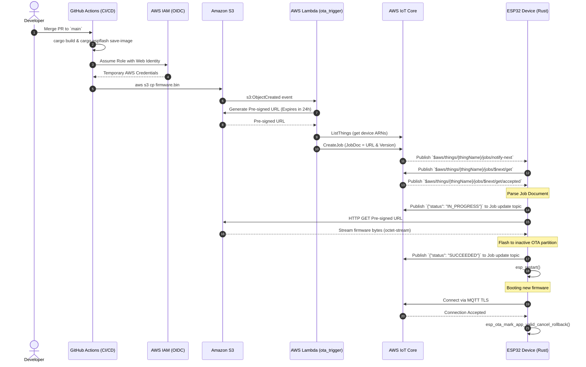

# ESP32 Over-The-Air (OTA) Flow

This document outlines the architecture and workflow of the ESP32 OTA process using AWS IoT Jobs, GitHub Actions, S3, and AWS Lambda.

## Architecture

The OTA process leverages the following services:
- **GitHub Actions**: Compiles the Rust firmware and authenticates securely with AWS using OpenID Connect (OIDC).
- **Amazon S3**: Stores the compiled firmware binary (`.bin` files).
- **AWS Lambda**: Triggered by S3 upload events, this serverless function generates a 24-hour pre-signed URL and creates an AWS IoT Job targeting the device fleet.
- **AWS IoT Jobs**: Native fleet management service that tracks the firmware rollout, handles device offline status, and tracks execution status (`IN_PROGRESS`, `SUCCEEDED`, `FAILED`).
- **ESP32 Firmware**: Written in Rust (`esp-idf-svc`), it downloads the firmware directly into the inactive OTA partition, swaps the boot partition, and automatically rolls back if it fails to connect to AWS IoT on the next boot.

## Sequence Diagram

Below is a detailed sequence diagram showing the interactions across the components:

## Rollback Strategy
The ESP32 ESP-IDF provides application rollback capabilities. When a new firmware boots, it is marked as "pending verify". If the device crashes or fails to connect to the MQTT broker, the ESP32 will reboot, mark the new partition as invalid, and rollback to the previous partition.
In our `telemetry::run` loop, we only call `mark_valid()` **after** the MQTT connection is fully established. This guarantees we don't lock in a firmware version that has lost its connectivity stack.
