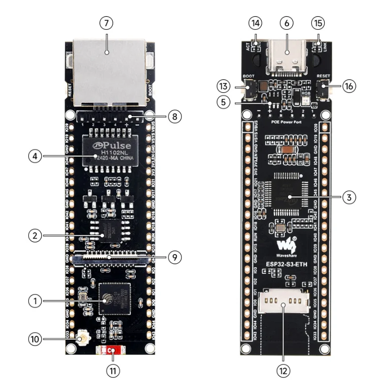
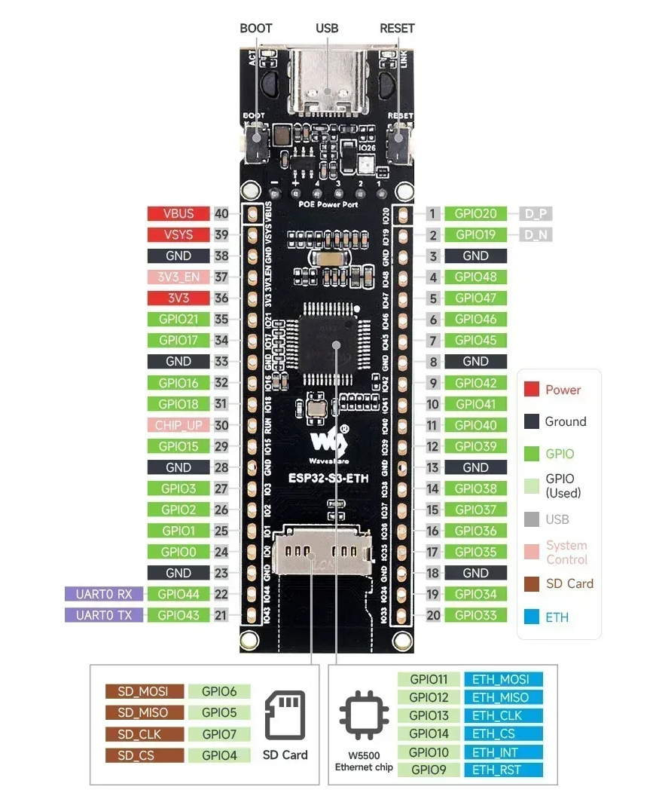
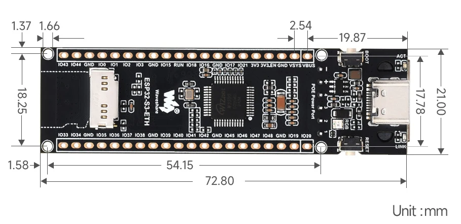

# Hardware Spec — Waveshare ESP32-S3-ETH

Board used for the OPC UA gateway: a Waveshare ESP32-S3-ETH module with built-in wired
Ethernet (W5500), PoE header, camera interface, and TF card slot.

## Board Photos

| # | Component | Description |
|---|-----------|-------------|
| 1 | ESP32-S3R8 | Xtensa 32-bit LX7 dual-core processor, up to 240MHz operating frequency |
| 2 | W25Q128 | 16MB Flash memory for program and data storage |
| 3 | W5500 | Ethernet chip |
| 4 | H1102NLT | Ethernet transformer |
| 5 | JW5060 | Voltage regulator |
| 6 | USB Type-C port | For power supply and program burning |
| 7 | RJ45 Ethernet port | 10/100M auto-negotiation Ethernet port |
| 8 | PoE module header | For connecting a PoE module |
| 9 | Camera interface | Compatible with OV2640, OV5640, and other mainstream cameras |
| 10 | IPEX 1 antenna connector | Reserved connector, enabled via resoldering an onboard resistor |
| 11 | Ceramic antenna | Used by default |
| 12 | TF card slot | — |
| 13 | BOOT button | — |
| 14 | ACT indicator | — |
| 15 | LINK indicator | — |
| 16 | RESET button | — |

## Pinout

- **UART0**: GPIO43 (TX) / GPIO44 (RX)
- **SD Card (SPI)**: MOSI=GPIO6, MISO=GPIO5, CLK=GPIO7, CS=GPIO4
- **W5500 Ethernet (SPI)**: MOSI=GPIO11, MISO=GPIO12, CLK=GPIO13, CS=GPIO14, INT=GPIO10, RST=GPIO9
- **Power rails**: 3V3, 3V3_EN, VSYS, VBUS
- **System control**: CHIP_UP (GPIO15 used)

## Board Dimensions

- Overall size: 72.80mm x 21.00mm
- Mounting hole spacing: 54.15mm x 17.78mm
- Unit: mm
